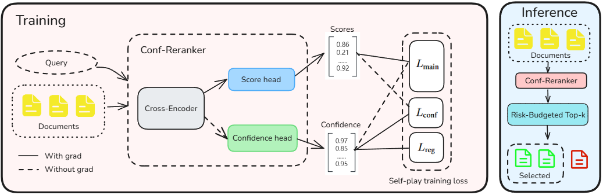
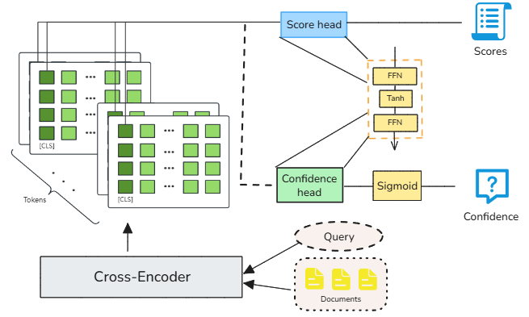
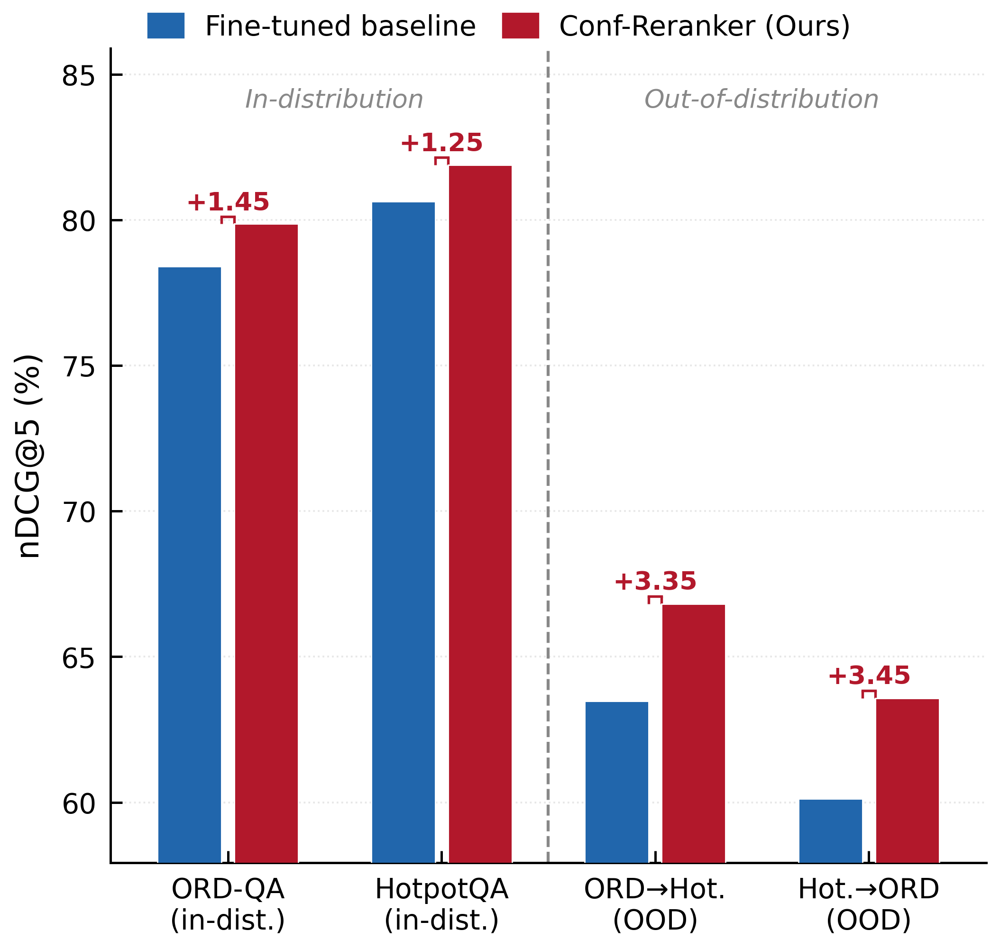
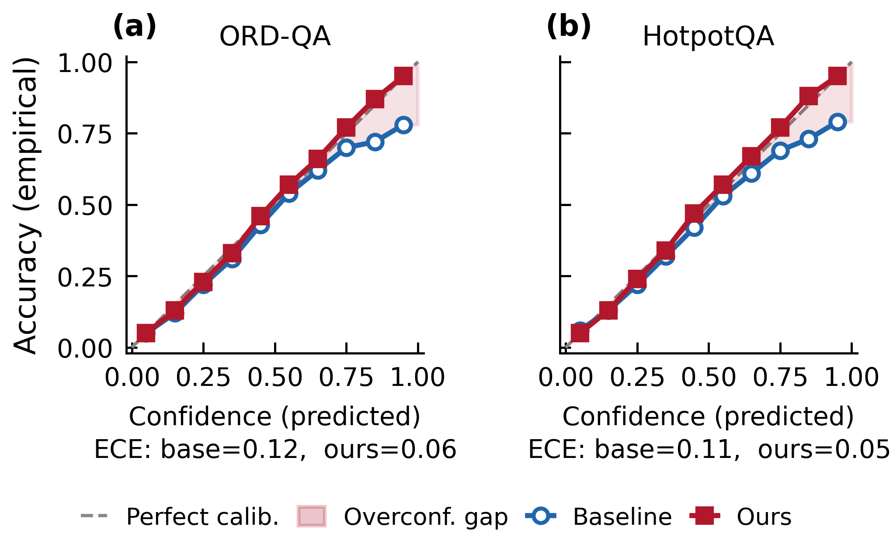
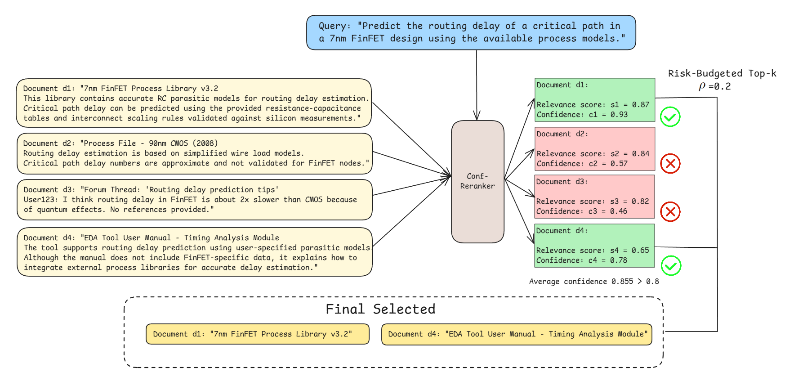

<h1 align="center">Conf-Reranker</h1>

<p align="center">
  <b>Confidence-Aware Cross-Encoder Reranking for Trustworthy RAG</b><br>
  <i>Joint ranking + calibration training with risk-budgeted Top-k* inference</i>
</p>

<p align="center">
  📄 <a href="#citation">Paper</a> &nbsp;|&nbsp;
  🧠 <a href="docs/method.md">Method Notes</a> &nbsp;|&nbsp;
  🚀 <a href="#quick-start">Quick Start</a> &nbsp;|&nbsp;
  📊 <a href="#results">Results</a> &nbsp;|&nbsp;
  🗺️ <a href="#release-roadmap">Roadmap</a>
</p>

<p align="center">
  
  
  
  
</p>

---

> ⚠️ **Status — Research Preview.** This repository accompanies the paper and
> implements the core method (model architecture, loss, inference) exactly as
> described. Large-scale training pipelines, pretrained checkpoints, and full
> benchmark reproduction scripts are part of the planned release; see
> [Release Roadmap](#release-roadmap) for what is currently included versus
> planned.

---

## 💡 What is Conf-Reranker?

Modern retrieval-augmented generation (RAG) pipelines commit to a fixed top-$k$
of retrieved passages, even when the reranker is **systematically overconfident**.
This is particularly painful in high-stakes domains such as **EDA tool documentation
QA**, where a single outdated PDK parameter can cause timing-closure failure
downstream.

**Conf-Reranker** addresses this with three coupled ideas:

1. **Dual-head cross-encoder.** A score head $s_i$ and a confidence head $c_i$
   share the encoder, with a stop-gradient on the confidence path so the ranker
   stays untouched.
2. **Ranker–auditor co-training.** A three-term objective —
   $\mathcal{L}_{\text{main}} + \lambda_c \mathcal{L}_{\text{conf}} + \lambda_r \mathcal{L}_{\text{reg}}$ —
   teaches the auditor to predict its own ranker's correctness without collapsing
   to a constant.
3. **Risk-Budgeted Top-$k^*$ inference.** Instead of fixed top-5, candidates are
   selected by utility $u_i = p_i \cdot c_i^\beta$ with an average-confidence
   gate $\rho$, adapting $k^*$ per query.

<p align="center">
  <br>
  <i>Figure 1 — Conf-Reranker framework: dual-head architecture with stop-gradient,
  co-trained with three-term loss, and Risk-Budgeted Top-k* inference.</i>
</p>

<p align="center">
  <br>
  <i>Figure 2 — Architecture detail. The score and confidence heads share the
  encoder representation, adding &lt;0.05% parameter overhead.</i>
</p>

---

## 📊 Results

### Main results — ORD-QA & HotpotQA

Reranking performance (%, mean over 3 seeds). **Bold** = best within each backbone group.
$\Delta$ = absolute improvement over Fine-tuned; all $\Delta$nDCG@5 improvements are
statistically significant at $p<0.01$ by paired permutation test.

| Backbone | Variant | ORD-QA MRR@5 | ORD-QA nDCG@5 | ORD-QA R@5 | HotpotQA MRR@5 | HotpotQA nDCG@5 | HotpotQA R@5 |
|---|---|---:|---:|---:|---:|---:|---:|
| DeBERTa-v3-base | Fine-tuned | 58.37 | 62.41 | 69.68 | 55.59 | 59.17 | 66.23 |
| DeBERTa-v3-base | **+ Conf-Reranker** | **59.84** | **64.15** | **71.95** | **57.26** | **61.34** | **68.71** |
| ELECTRA-base | Fine-tuned | 55.23 | 60.11 | 66.37 | 52.41 | 57.53 | 63.49 |
| ELECTRA-base | **+ Conf-Reranker** | **57.18** | **62.58** | **69.22** | **54.35** | **59.76** | **65.86** |
| BGE-reranker-large | Fine-tuned | 73.52 | 79.08 | 83.34 | 79.64 | 81.27 | 83.68 |
| BGE-reranker-large | **+ Conf-Reranker** | **74.89** | **80.73** | **85.12** | **80.92** | **82.51** | **84.53** |
| BGE-reranker-v2-m3 | Fine-tuned | 72.08 | 78.41 | 81.13 | 78.95 | 80.64 | 82.94 |
| BGE-reranker-v2-m3 | **+ Conf-Reranker** | **73.45** | **79.86** | **82.78** | **80.17** | **81.89** | **83.79** |

> **PLM gains:** $\Delta$nDCG@5 = **+1.74 ~ +2.47%**.
> **Dedicated reranker gains:** $\Delta$nDCG@5 = **+1.24 ~ +1.65%** (less headroom).
> Recall@1/3 numbers and per-seed values are reported in the supplementary material.

### Comparison with uncertainty / reranking baselines

On BGE-reranker-v2-m3, single A6000 (FP16). Latency in ms/query.

| Method | ORD-QA nDCG@5 | ORD-QA ECE | HotpotQA nDCG@5 | HotpotQA ECE | Params (M) | Latency (ms) | Mem (GB) |
|---|---:|---:|---:|---:|---:|---:|---:|
| Fine-tuned (top-5) | 78.41 | 0.12 | 80.64 | 0.11 | 568.0 | 7.8 | 6.2 |
| + Label Smoothing | 78.62 | 0.08 | 80.82 | 0.08 | 568.0 | 7.8 | 6.2 |
| + MC Dropout (T=10) | 78.74 | 0.07 | 80.93 | 0.07 | 568.0 | 41.2 | 6.2 |
| + Deep Ensembles (M=5) | 79.10 | 0.08 | 81.20 | 0.07 | 2840 | 25.3 | 31.0 |
| + Temperature Scaling | 78.90 | **0.05** | 81.00 | 0.06 | 568.0 | 7.9 | 6.2 |
| + Evidential Ranking | 78.97 | 0.07 | 81.12 | 0.07 | 568.1 | 8.0 | 6.2 |
| Self-RAG (rerank) | 78.83 | 0.10 | 80.87 | 0.10 | 568.0 | 46.5 | 6.2 |
| RankZephyr-7B distilled | 79.42 | 0.11 | 81.65 | 0.10 | 7000 | 152.0 | 14.0 |
| **Ours (fixed top-5)** | 79.63 | 0.06 | 81.72 | **0.05** | 568.3 | 8.0 | 6.3 |
| **Ours (Top-$k^*$, ρ=0.2)** | **79.86** | 0.06 | **81.89** | **0.05** | 568.3 | **8.1** | **6.3** |

> Conf-Reranker matches Temperature Scaling on ECE while gaining **+1.45 / +1.25 nDCG@5**
> on ORD-QA / HotpotQA, at essentially zero extra latency / memory.

### OOD generalization (zero-shot cross-dataset)

<p align="center">
  <br>
  <i>Figure 3 — Zero-shot cross-dataset OOD generalization on BGE-reranker-v2-m3.
  Conf-Reranker improves nDCG@5 by <b>+3.35</b> (ORD-QA→HotpotQA) and
  <b>+3.45</b> (HotpotQA→ORD-QA), 2–3× larger than in-distribution gains.</i>
</p>

### Calibration

<p align="center">
  <br>
  <i>Figure 4 — Reliability diagrams (ORD-QA left, HotpotQA right). Conf-Reranker
  (red) tracks the perfect-calibration diagonal; the fine-tuned baseline (blue)
  is systematically overconfident at high probabilities.</i>
</p>

### Case study: Noisy EDA candidate reranking

<p align="center">
  <br>
  <i>Figure 5 — On a 7nm FinFET routing-delay query, two high-relevance but
  low-confidence candidates (an outdated PDK timing model, unverifiable forum
  claims) are filtered by the ρ=0.2 confidence gate, preventing contaminated
  evidence from leaking into downstream generation.</i>
</p>

---

## 📦 Repository Layout

```
conf-reranker/
├── conf_reranker/          # Core library (importable)
│   ├── model.py            # Dual-head cross-encoder (Eq. 1-2)
│   ├── loss.py             # L_main + λ_c L_conf + λ_r L_reg (Eq. 3-6)
│   ├── inference.py        # Risk-Budgeted Top-k* (Algorithm 1)
│   ├── trainer.py          # Co-training loop skeleton
│   └── data.py             # JSONL dataset + collator
├── scripts/
│   ├── demo.py             # 60s CPU demo (try this first!)
│   ├── run_train.py        # Training entry
│   ├── run_eval.py         # Evaluation entry
│   ├── train.sh            # Example launch script
│   └── eval.sh
├── configs/
│   ├── default.yaml        # Defaults (λ_c=0.9, λ_r=0.2, ρ=0.2, β=2)
│   ├── ord_qa.yaml         # ORD-QA preset
│   └── hotpotqa.yaml       # HotpotQA preset
├── data/
│   ├── README.md           # Data prep instructions
│   └── sample/toy.jsonl    # 4-record toy dataset for demo
├── tests/                  # Smoke tests
├── docs/
│   ├── method.md           # Method walk-through
│   └── assets/             # Figures (shared with paper)
├── requirements.txt
├── setup.py
├── LICENSE                 # MIT
└── CITATION.cff
```

---

## 🚀 Quick Start

### Installation

```bash
git clone https://github.com/anonymous/conf-reranker.git    # anonymized
cd conf-reranker
python -m venv .venv && source .venv/bin/activate   # Python 3.10+
pip install -e .                                    # installs core deps
```

### Run the 60-second demo

The demo loads a small public cross-encoder, builds the dual-head wrapper, and
runs Risk-Budgeted Top-$k^*$ inference on a toy 4-passage example. **No GPU,
no dataset download required.**

```bash
python -m scripts.demo
```

Expected output (truncated):

```
Query: "Predict routing delay of critical path in 7nm FinFET..."
Candidates after dual-head scoring:
  d1   s=0.87  c=0.93   utility=0.752
  d2   s=0.84  c=0.57   utility=0.273
  d3   s=0.82  c=0.46   utility=0.174
  d4   s=0.65  c=0.78   utility=0.395
Risk-Budgeted Top-k* (ρ=0.2):
  Selected: [d1, d4]   (k*=2, mean confidence=0.855 > ρ)
```

### Programmatic API

```python
import torch
from conf_reranker import ConfReranker, risk_budgeted_topk
from conf_reranker.model import ConfRerankerConfig
from conf_reranker.inference import RiskBudgetConfig
from transformers import AutoTokenizer

cfg = ConfRerankerConfig(backbone_name="cross-encoder/ms-marco-MiniLM-L-6-v2")
model = ConfReranker(cfg).eval()
tok = AutoTokenizer.from_pretrained(cfg.backbone_name)

scores, confs = model.score("query text", ["doc 1", "doc 2", "doc 3"], tokenizer=tok)
selected, utility, _, low_conf = risk_budgeted_topk(
    scores, confs, RiskBudgetConfig(rho=0.2, beta=2.0)
)
```

### Reproducing the paper

> ⏳ **Planned.** Pretrained checkpoints, ORD-QA / HotpotQA preprocessing, and
> the full sweep over 4 backbones × 7 baselines are large enough to warrant a
> separate release pass. The current repository releases the **method
> implementation**; if you want to retrain from scratch on your own data,
> `configs/default.yaml` already contains all hyperparameters reported in
> Section VI of the paper.

---

## 🗺️ Release Roadmap

| Milestone | Status |
|---|---|
| Core method (model / loss / inference) | ✅ Released |
| Demo & toy data | ✅ Released |
| Documentation (method walk-through) | ✅ Released |
| Pretrained checkpoints (BGE-v2-m3, DeBERTa-v3) | 🔜 Planned |
| ORD-QA / HotpotQA reproduction scripts | 🔜 Planned |
| Multi-backbone training sweep | 🔜 Planned |
| Journal extension benchmarks | 🔜 Planned |

---

## 📚 Datasets

| Dataset | Source | Used For |
|---|---|---|
| ORD-QA | [Pu et al., 2024](https://github.com/lesliepy99/RAG-EDA) | EDA documentation QA (in-domain) |
| HotpotQA (fullwiki) | [Yang et al., 2018](https://hotpotqa.github.io/) | Open-domain multi-hop QA (OOD) |

We do **not** redistribute the datasets. Please follow each dataset's original
license and download instructions; see [`data/README.md`](data/README.md) for the
expected JSONL layout.

---

## 🤝 Acknowledgements

This work builds on
[BGE](https://github.com/FlagOpen/FlagEmbedding) reranker family,
[ORD-QA / RAG-EDA](https://github.com/lesliepy99/RAG-EDA),
and the [HotpotQA](https://hotpotqa.github.io/) benchmark.
We thank the authors of these resources for releasing them publicly.

---

## 📖 Citation

If you use this code or method in your research, please cite our paper:

```bibtex
@article{confreranker,
  title   = {Confidence-Aware Cross-Encoder Reranking for Trustworthy
             Retrieval-Augmented Generation},
  author  = {Anonymous Authors},
  journal = {IEEE Transactions on Computer-Aided Design of Integrated
             Circuits and Systems (TCAD)},
  year    = {to appear},
  note    = {Preprint.}
}
```

> ℹ️ The BibTeX above will be updated with the final author list, volume, and
> page numbers once the paper is published.

---

## 📝 License

This project is released under the [MIT License](LICENSE). The pretrained
checkpoints (when released) will be subject to the underlying backbones'
respective licenses (Apache-2.0 for BGE family, MIT for DeBERTa).

---

## 📮 Contact

For questions about the method, please open a GitHub Issue. For questions
specific to the editorial process, please contact the corresponding author
through the journal editorial system.
